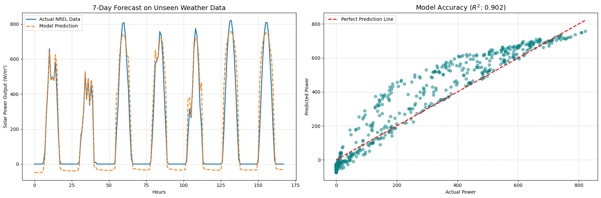

# Solar Yield Prediction: Pure NumPy Machine Learning Engine

A pure mathematics implementation of a Linear Regression model built entirely from scratch using only NumPy. This project constrains the use of standard libraries like Scikit-Learn to demonstrate a fundamental understanding of Gradient Descent, Linear Algebra, and the foundational architecture of Machine Learning.

## The Results
The custom engine achieved an **$R^2$ score of 80.93%** on newly provided testing data, successfully proving its ability to generalize and predict complex solar energy curves based purely on raw meteorological conditions.

## Core Architecture
- **Mathematical Engine:** Custom Gradient Descent loop calculating Mean Squared Error (MSE) derivatives matrix-by-matrix.
- **The Bias Solution:** Implemented a purely vectorized bias vector by appending a column of `1`s directly to the feature matrix.
- **Data Integrity:** Strict chronological Train/Test splitting to prevent Data Leakage and ensure true generalization.
- **Production OOP Design:** Refactored the procedural math into a Class-based `.fit()` and `.predict()` methods.

## The Data
The model is trained on National Laboratory of the Rockies (NLR) meteorological data, making use of features such as:
- **DNI (Direct Normal Irradiance):** The primary driver of solar panel yield.
- **DHI (Diffuse Horizontal Irradiance):** Scattered sunlight.
- **Temperature & Wind Speed:** Environmental factors affecting panel efficiency.

## How to Run
1. Clone the repository: `git clone https://github.com/YOUR-USERNAME/solar-yield-prediction-from-scratch.git`
2. Install dependencies: `pip install numpy matplotlib pandas jupyter`
3. Run the notebook: `jupyter notebook notebooks/01_data_inspection.ipynb`