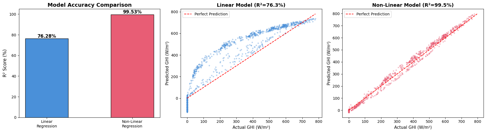

# Solar Yield Prediction: Pure NumPy Machine Learning Engine

## Description
Solar power is inherently volatile. Grid operators need accurate forecasts of Global Horizontal Irradiance (GHI) to balance the electrical grid and prevent blackouts. 

This project tackles that problem by predicting solar yield using weather and time data from the **NREL NSRDB (National Solar Radiation Database)** for Phoenix, Arizona. 

The core of this machine learning architecture is built entirely **from scratch in pure NumPy**. This includes custom gradient descent, non-linear feature engineering, and a time-series cross-validation algorithm to strictly prevent data leakage.

## The Results
The custom engine achieved a **Linear $R^2$ score of 76.3%** and **Non-Linear $R^2$ score of 99.5** on newly provided testing data, successfully proving its ability to generalize and predict complex solar energy curves based purely on raw meteorological conditions.

This also proves that a Non-Linear approach has better accuracy when it comes to predicting Global Horizontal Irradiance. That is because the GHI is dependent on the Non-Linear Solar Zenith Angle. 

## Core Features
* **Custom ML Engine:** Built a `CustomLinearRegression` class from scratch using pure matrix math and gradient descent.
* **Non-Linear Feature Engineering:** Transformed the Solar Zenith Angle (SZA) into a cosine wave to model the diurnal cycle of the sun, and applied Polynomial Degree 2 features to capture optimal temperature thresholds.
* **Physics-Informed Logic:** Implemented ReLU (Rectified Linear Unit) clamping to prevent the model from predicting impossible negative power generation at night.
* **Strict Time-Series Validation:** Engineered a custom expanding-window cross-validation script to evaluate the model chronologically, eliminating the "time travel" data leakage caused by standard K-Fold validation.

## The Data
The model is trained on National Laboratory of the Rockies (NLR) meteorological data, making use of features such as:
* **GHI (Global Horizontal Irradiance):** The total solar radiation received by a horizontal surface. *(This is the primary target variable we are predicting).*
* **DNI (Direct Normal Irradiance):** The amount of solar radiation received directly from the sun in a straight line.
* **DHI (Diffuse Horizontal Irradiance):** Scattered sunlight that reaches the ground indirectly (e.g., passing through clouds).
* **Temperature:** Ambient air temperature. This is a critical feature because excessive heat actually lowers the physical efficiency of solar panel hardware.
* **Wind Speed :** An environmental factor that helps cool the solar panels, indirectly impacting their performance.
* **Solar Zenith Angle:** The angle of the sun in the sky. In the Advanced model, this feature is transformed into a cosine wave to mathematically represent the natural "arc" of a day.
